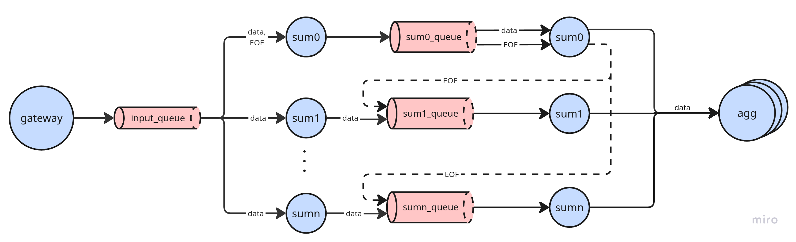
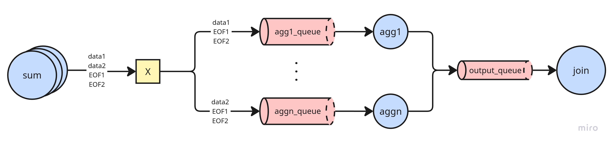

# Informe - Trabajo práctico de Coordinación

## Tabla de contenidos

- [Coordinación entre instancias de Sum](#coordinación-entre-instancias-de-sum)
  - [Modelo de threads](#modelo-de-threads)
  - [Shutdown](#shutdown)
- [Coordinación entre instancias de Aggregation](#coordinación-entre-instancias-de-aggregation)
  - [Shutdown](#shutdown-1)
- [Joiner](#joiner)
  - [Shutdown](#shutdown-2)
- [Escalabilidad respecto a los clientes](#escalabilidad-respecto-a-los-clientes)
- [Escalabilidad respecto a la cantidad de controles](#escalabilidad-respecto-a-la-cantidad-de-controles)

## Coordinación entre instancias de Sum

Cada instancia de Sum es un contenedor independiente que lee de una cola compartida (`input_queue`). RabbitMQ distribuye los mensajes de forma competitiva: cada mensaje lo procesa exactamente una instancia. Cada instancia reenvía los mensajes a su propia cola dedicada (`sum_0`, `sum_1`, ...) y acumula los pares `(fruta, cantidad)` agrupados por `client_id`.

El problema de coordinación surge con el EOF: el mensaje de fin de ingesta de un cliente llega a una sola instancia, pero las demás también tienen datos acumulados de ese cliente que deben enviarse.

Para resolverlo, cada instancia tiene una cola dedicada que recibe tanto los datos reenviados desde `input_queue` como los EOFs propagados por otras instancias. Cuando una instancia recibe el primer EOF de un cliente por su cola dedicada, lo propaga al resto de las colas dedicadas y flushea sus datos acumulados hacia los Aggregators. Cualquier EOF posterior del mismo cliente se descarta. La cola garantiza el orden FIFO: el EOF siempre llega después de todos los datos del cliente, eliminando la posibilidad de race conditions.

Los datos se rutean a los Aggregators según `hash(fruta, client_id) % M`. El hash se calcula con MD5 de la stdlib, lo que garantiza resultados determinísticos e idénticos en todos los contenedores para el mismo par `(fruta, client_id)`.

De esta forma, con `N` instancias de Sum, cada Aggregator recibe exactamente `N` EOFs por cliente, lo que le permite saber cuándo consolidar su top parcial.

  

### Modelo de threads

Dado que `pika` en modo blocking no permite escuchar dos fuentes simultáneamente desde un mismo thread, cada instancia de Sum corre dos threads:

- **Thread principal**: consume `input_queue` y reenvía cada mensaje a la cola dedicada de la instancia.
- **Thread secundario**: consume la cola dedicada. Acumula datos y maneja el EOF con la lógica de propagación y flush.

Todo el estado (`amount_by_fruit`, `eof_received`) vive exclusivamente en el thread secundario, por lo que no se necesita sincronización entre threads.

### Shutdown

Al recibir `SIGTERM`, el proceso detiene el consumo del thread principal. Una vez que `start_consuming` retorna, el main thread detiene el thread secundario y espera su finalización con `join` antes de cerrar las conexiones.

## Coordinación entre instancias de Aggregation

Cada instancia de Aggregation se suscribe al exchange `AGGREGATION_PREFIX` usando únicamente su propia routing key (`{AGGREGATION_PREFIX}_{ID}`), recibiendo solo los mensajes que Sum le dirige según `hash(fruta, client_id) % M`. Esto garantiza que una fruta determinada de un cliente siempre es procesada por el mismo Aggregator, sin necesidad de sincronización entre instancias.

Cada instancia mantiene dos estructuras por cliente:

- `fruit_top`: `{client_id: {fruit: FruitItem}}` — acumula totales por fruta con lookups y updates en O(1) por mensaje.
- `eof_count`: `{client_id: int}` — cuenta los EOFs recibidos por cliente.

Cuando `eof_count[client_id]` alcanza `SUM_AMOUNT`, el Aggregator sabe que recibió todos los datos de ese cliente. Recién en ese momento ordena los acumulados con `sorted()` en O(n log n), toma los últimos `TOP_SIZE` elementos y envía el top parcial al Joiner. Ordenar solo al flush evita mantener una lista ordenada durante la acumulación, que costaría O(n) por cada mensaje recibido.

Tras el flush se liberan explícitamente las estructuras del cliente con `clear()` y `pop()`.

  

### Shutdown

Al recibir `SIGTERM`, el proceso detiene el consumo llamando `stop_consuming()` sobre el exchange de entrada, lo que cierra el canal y la conexión. Una vez que `start_consuming` retorna, `start()` cierra el `output_queue`. Las estructuras en memoria (`fruit_top`, `eof_count`) se liberan cuando el proceso termina.

## Joiner

El Joiner recibe los tops parciales de cada instancia de Aggregation y los mergea en el top final por cliente. Mantiene `partial_tops` (`{client_id: [[fruit, amount], ...]}`) donde acumula los tops parciales a medida que llegan. Cuando recibe `AGGREGATION_AMOUNT` tops para un cliente, suma los amounts de frutas que aparecen en múltiples tops, ordena con `sorted()` y toma los últimos `TOP_SIZE` elementos.

Un Aggregator que no recibió frutas de un cliente igual envía un top parcial vacío, ya que el EOF de cada Sum llega a todos los Aggregators. El Joiner lo cuenta como uno de los `AGGREGATION_AMOUNT` esperados y el merge lo ignora naturalmente.

El resultado final se serializa como `[client_id, [[fruit, amount], ...]]` y se envía al Gateway, que lo rutea al cliente correcto usando el `client_id` como filtro.

### Shutdown

Al recibir `SIGTERM`, el proceso detiene el consumo llamando `stop_consuming()` sobre el `input_queue`. Una vez que `start_consuming` retorna, `start()` cierra el `output_queue`.

## Escalabilidad respecto a los clientes

El `client_id` generado por el Gateway al momento de la conexión viaja en todos los mensajes del pipeline. Cada control (Sum, Aggregation, Joiner) mantiene estado separado por `client_id`, por lo que múltiples clientes pueden procesarse concurrentemente sin interferir entre sí.

## Escalabilidad respecto a la cantidad de controles

La cantidad de instancias se configura mediante variables de entorno (`SUM_AMOUNT`, `AGGREGATION_AMOUNT`) reflejadas en el docker-compose.

- Agregar instancias de **Sum** distribuye la carga de acumulación. Cada instancia tiene su cola dedicada y la propagación del EOF garantiza que todas flusheen sus datos independientemente de cuál reciba el EOF original. El Aggregator usa `SUM_AMOUNT` para saber cuántos EOFs esperar.
- Agregar instancias de **Aggregation** distribuye el espacio de frutas. El hash determinístico de `(fruta, client_id)` asegura que cada fruta de un cliente siempre va al mismo Aggregator. El Joiner usa `AGGREGATION_AMOUNT` para saber cuántos tops parciales esperar antes de calcular el resultado final.